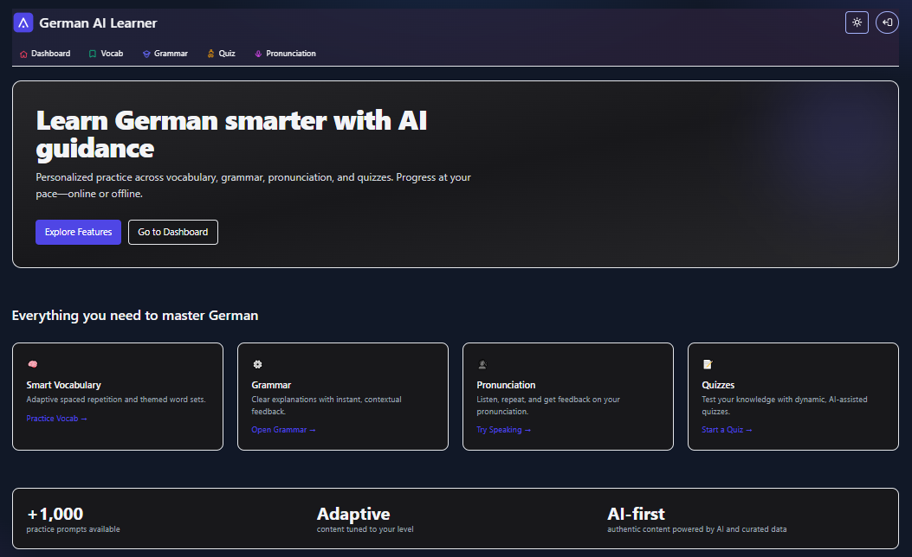

# AI-Powered German Language Learner (Monorepo)

Monorepo containing:
- `frontend/` — Next.js + Tailwind UI
- `backend/` — FastAPI + MongoDB

This project is portfolio-focused and production-ready to demo. It follows an AI-first policy with DB-only as the secondary source (no static placeholders):
- Grammar Coach, Speech Coach, Quiz generation: use AI if `OPENAI_API_KEY` is set; otherwise use seeded DB data. If neither is available, endpoints return clear 503 responses (no simulated or static results).

## Quick Start (Docker - Recommended)

Prereqs:
- Docker and Docker Compose
- MongoDB Atlas URI (or local MongoDB)

### 1. Clone and Configure
```bash
git clone https://github.com/saud06/german-ai.git
cd german-ai

# Copy environment template
cp .env.example .env

# Edit .env with your settings (required):
# - MONGODB_URI: Your MongoDB Atlas connection string
# - JWT_SECRET: A secure random string (32+ characters)
# - OPENAI_API_KEY: Optional, for AI features
nano .env
```

**Required Configuration:**
- **MONGODB_URI**: Get from [MongoDB Atlas](https://cloud.mongodb.com/) (free tier available)
- **JWT_SECRET**: Generate with `openssl rand -base64 32` or use any secure 32+ character string
- **OPENAI_API_KEY**: Optional, get from [OpenAI Platform](https://platform.openai.com/api-keys) for AI features

### 2. Run with Docker
```bash
docker compose up --build
```

### 3. Access the Application
- **Frontend**: http://localhost:3000
- **Backend API**: http://localhost:8000/docs

### 4. Demo Login
Use these credentials to test the application:
- **Email**: `saud@gmail.com`
- **Password**: `password`

## Features

### 🤖 AI-Powered (with OPENAI_API_KEY)
- Grammar checking with AI suggestions
- AI-generated quiz questions
- Enhanced speech feedback

### 📚 Database-First (without OPENAI_API_KEY)
- Pre-seeded vocabulary and grammar rules
- Static quiz questions from database
- Basic speech recognition

### 🎯 Core Features
- German vocabulary learning
- Grammar exercises
- Speech practice
- Progress tracking
- Quiz system

## Docker Commands

```bash
# Start the application
docker compose up --build

# Start in background (detached mode)
docker compose up --build -d

# Stop the application
docker compose down

# View logs
docker compose logs backend
docker compose logs frontend

# Rebuild after code changes
docker compose up --build --force-recreate
```

## Local Development (Optional)

If you prefer local development without Docker, see the detailed setup instructions in the legacy documentation. The Docker approach above is recommended for consistency and ease of setup.

### Screenshots

Below are example screenshots. If viewing on GitHub, the images will render if you add the files at the referenced paths.

- Home page

  

- Dashboard

  

## Docker (one command demo)

Requirements: Docker and Docker Compose

1) Build and run the full stack (MongoDB + Backend + Frontend):
```
docker compose up --build
```

2) Open:
- Frontend: http://localhost:3000
- API docs: http://localhost:8000/docs

By default, the stack runs in DB-first mode with AI disabled and dev routes off. To enable AI features:
- Set `OPENAI_API_KEY` in `docker-compose.yml` for the `backend` service.
- Optionally set `ENABLE_AI_QUIZ_TOPUP=true` to top-up quizzes with AI-generated questions.
Dev/admin routes are not included in production images by default. To enable them only in a non-production environment, set both `DEV_MODE=true` and `ALLOW_DEV_ROUTES=true`.

## Deploy (overview)

- Backend: Render Web Service
  - Build: `pip install -r backend/requirements.txt`
  - Start: `uvicorn app.main:app --host 0.0.0.0 --port $PORT --app-dir backend`
  - Env: `MONGODB_URI`, `JWT_SECRET`, optional `OPENAI_API_KEY`, `ALLOW_SPEECH_FEATURE`, `ENABLE_AI_QUIZ_TOPUP`, `DEV_MODE` (default false), `ALLOW_DEV_ROUTES` (default false)

- Frontend: Render Static Site
  - Build command: `npm i && npm run build`
  - Publish directory: `frontend/.next`
  - Env: `NEXT_PUBLIC_API_BASE_URL`

## Environment variables

Backend (`backend/.env.example`):
- MONGODB_URI=
- MONGODB_DB_NAME=  # optional; defaults to german_ai
- JWT_SECRET=
- OPENAI_API_KEY=  # optional
- ALLOW_SPEECH_FEATURE=true
- ENABLE_AI_QUIZ_TOPUP=false
- DEV_MODE=false
- ALLOW_DEV_ROUTES=false

Frontend (`frontend/.env.local`):
- NEXT_PUBLIC_API_BASE_URL=http://localhost:8000/api/v1

## Notes
- All protected routes require `Authorization: Bearer <token>`.
- AI-first then DB behavior is implemented in:
  - `backend/app/services/ai.py::grammar_check()`
  - `backend/app/routers/speech.py::speech_check()`
  - `backend/app/seed/utils.py::get_quiz_set()` (AI top-up optional)
- Seed data in `backend/seed/` provides initial content for DB.

## CI

GitHub Actions workflows:
- `.github/workflows/backend.yml` — installs backend deps and runs `pytest`.
- `.github/workflows/frontend.yml` — installs deps, type-checks, and builds Next.js.

## Website

https://german-ai.fly.dev
