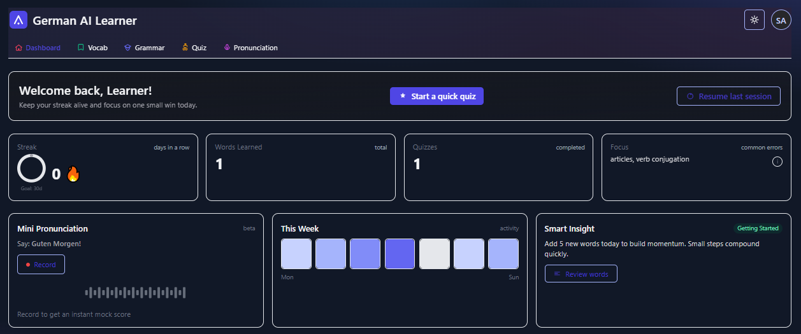

# AI-Powered German Language Learner (Monorepo)

Monorepo containing:
- `frontend/` — Next.js + Tailwind UI
- `backend/` — FastAPI + MongoDB

This project is portfolio-focused and production-ready to demo. It follows an AI-first policy with DB-only as the secondary source (no static placeholders):
- Grammar Coach, Speech Coach, Quiz generation: use AI if `OPENAI_API_KEY` is set; otherwise use seeded DB data. If neither is available, endpoints return clear 503 responses (no simulated or static results).

## Quick start

Prereqs:
- Node.js 18+
- Python 3.10+
- MongoDB Atlas URI (or local Mongo for dev)

## Production Setup

Set the following environment variables for the backend (via your hosting provider or Docker secrets):

```bash
# Backend (FastAPI)
MONGODB_URI=mongodb+srv://<user>:<pass>@<cluster>/<db>?retryWrites=true&w=majority
MONGODB_DB_NAME=german
JWT_SECRET=<long-random-secret>
# Optional AI
OPENAI_API_KEY=<your-openai-key>           # optional; enables AI features
ENABLE_AI_QUIZ_TOPUP=false                 # set true only when OPENAI_API_KEY is set

# Mode flags (safe defaults)
DEV_MODE=false
ALLOW_DEV_ROUTES=false
```

Frontend:

```bash
# Next.js
NEXT_PUBLIC_API_BASE_URL=https://<your-backend-domain>/api/v1
```

Docker (local or server):

```bash
docker compose up --build -d
```

## Backend

1) Create `.env` from example:
```
cp backend/.env.example backend/.env
```
Fill values (at least `MONGODB_URI`, `JWT_SECRET`).

2) Install deps and run:
```
python -m venv .venv
. .venv/Scripts/activate  # Windows PowerShell: .venv\Scripts\Activate.ps1
pip install -r backend/requirements.txt
uvicorn app.main:app --host 0.0.0.0 --port 8000 --reload --app-dir backend
```

API docs: http://localhost:8000/docs

## Frontend (Next.js only)

1) Install and run:
```
cd frontend
npm i
npm run dev
```

Then open http://localhost:3000

Set `NEXT_PUBLIC_API_BASE_URL` in `frontend/.env.local` (e.g. `http://localhost:8000/api/v1`).

Note: This project uses Next.js only (no Streamlit).

### Demo login (for preview)

Use the following temporary demo account on the login page:

- Email: `saud@gmail.com`
- Password: `password`

### Screenshots

Below are example screenshots. If viewing on GitHub, the images will render if you add the files at the referenced paths.

- Home page

  

- Dashboard

  

## Docker (one command demo)

Requirements: Docker and Docker Compose

1) Build and run the full stack (MongoDB + Backend + Frontend):
```
docker compose up --build
```

2) Open:
- Frontend: http://localhost:3000
- API docs: http://localhost:8000/docs

By default, the stack runs in DB-first mode with AI disabled and dev routes off. To enable AI features:
- Set `OPENAI_API_KEY` in `docker-compose.yml` for the `backend` service.
- Optionally set `ENABLE_AI_QUIZ_TOPUP=true` to top-up quizzes with AI-generated questions.
Dev/admin routes are not included in production images by default. To enable them only in a non-production environment, set both `DEV_MODE=true` and `ALLOW_DEV_ROUTES=true`.

## Deploy (overview)

- Backend: Render Web Service
  - Build: `pip install -r backend/requirements.txt`
  - Start: `uvicorn app.main:app --host 0.0.0.0 --port $PORT --app-dir backend`
  - Env: `MONGODB_URI`, `JWT_SECRET`, optional `OPENAI_API_KEY`, `ALLOW_SPEECH_FEATURE`, `ENABLE_AI_QUIZ_TOPUP`, `DEV_MODE` (default false), `ALLOW_DEV_ROUTES` (default false)

- Frontend: Render Static Site
  - Build command: `npm i && npm run build`
  - Publish directory: `frontend/.next`
  - Env: `NEXT_PUBLIC_API_BASE_URL`

## Environment variables

Backend (`backend/.env.example`):
- MONGODB_URI=
- MONGODB_DB_NAME=  # optional; defaults to german_ai
- JWT_SECRET=
- OPENAI_API_KEY=  # optional
- ALLOW_SPEECH_FEATURE=true
- ENABLE_AI_QUIZ_TOPUP=false
- DEV_MODE=false
- ALLOW_DEV_ROUTES=false

Frontend (`frontend/.env.local`):
- NEXT_PUBLIC_API_BASE_URL=http://localhost:8000/api/v1

## Notes
- All protected routes require `Authorization: Bearer <token>`.
- AI-first then DB behavior is implemented in:
  - `backend/app/services/ai.py::grammar_check()`
  - `backend/app/routers/speech.py::speech_check()`
  - `backend/app/seed/utils.py::get_quiz_set()` (AI top-up optional)
- Seed data in `backend/seed/` provides initial content for DB.

## CI

GitHub Actions workflows:
- `.github/workflows/backend.yml` — installs backend deps and runs `pytest`.
- `.github/workflows/frontend.yml` — installs deps, type-checks, and builds Next.js.
